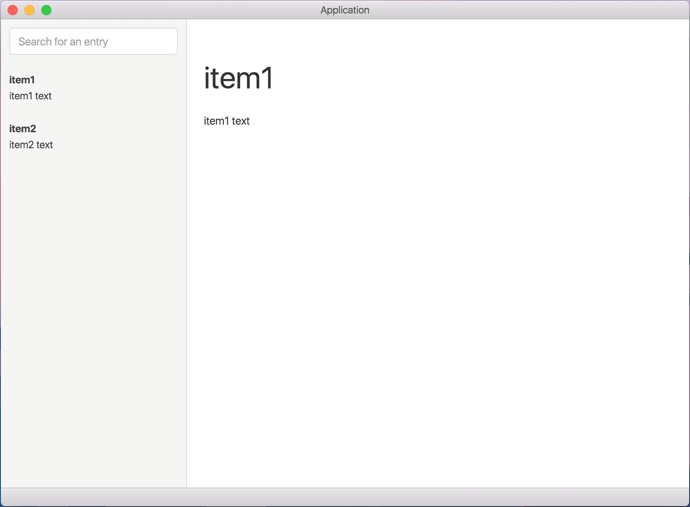

# electron-react-reflux-photon-example

Simple app example that incorporates [electron](http://electron.atom.io), [react](https://facebook.github.io/react/), [react-router](https://github.com/rackt/react-router), [reflux](https://github.com/reflux/refluxjs), and [photon](http://photonkit.com).



## Dev

```
$ npm install
```

### Run

```
$ gulp serve
```

### Build

```
$ npm run build
```
